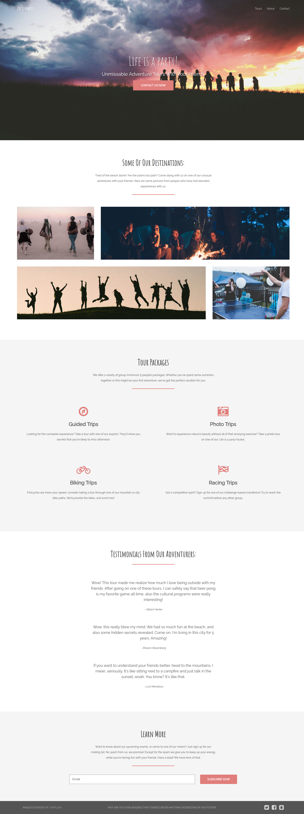

# Session 2 Collaborative Landing Page Project

An instructional CSS project designed for learning Flexbox, Git collaboration, and CSS fundamentals through hands-on team-based development.

## Overview

This is a collaborative project where teams work together to build a professional landing page. Each team focuses on a specific section of the page, practicing CSS layout techniques while learning Git workflow and team collaboration.

### Final Result Preview



This is what we're building together! Each team will style their section, and when merged, it creates this complete professional landing page.

## What You'll Learn

- **Flexbox layouts** - horizontal and vertical alignment, flex-basis, flex-wrap
- **CSS Box Model** - margins, padding, and spacing
- **CSS Positioning** - relative and absolute positioning for overlays
- **Typography** - font properties and text styling
- **Git workflow** - branching, committing, and merging
- **Team collaboration** - working independently on separate sections

## Project Structure

```
Session2Project/
├── index.html              # Main HTML structure
├── assets/
│   ├── css/                # CSS styling files
│   └── images/             # Background images
└── README.md
```

## Team Sections

The landing page is divided into 6 sections:

1. **Team 1** - Header Navigation (Flexbox layout, absolute positioning)
2. **Team 2** - Hero Section (Vertical centering, typography, background images)
3. **Team 3** - Destinations Gallery (Background images, flex-basis sizing)
4. **Team 4** - Packages Section (Card layout, centered content)
5. **Team 5** - Testimonials & Contact Form (Form layout with flex: 1)
6. **Team 6** - Footer (Horizontal distribution, nested flexbox)

## Getting Started

### 1. Clone the Repository

```bash
git clone https://github.com/Alae-J/Session2-Collaborative-Landing-Page.git
cd Session2-Collaborative-Landing-Page
```

### 2. Create Your Team Branch

```bash
git checkout -b team-1-header
```

Replace `team-1-header` with your team's branch name.

### 3. Work on Your Section

1. Open `assets/css/styles.css`
2. Find your team's section (marked with comments)
3. Uncomment CSS properties and fill in the values
4. Don't modify other teams' sections!

### 4. Test Your Work

Open `index.html` in your browser to see your changes. Your section might look incomplete initially - that's normal! Other teams are working on their parts.

### 5. Commit and Push

```bash
git add .
git commit -m "Complete team 1 header styling"
git push -u origin team-1-header
```

Write your own commit message describing what your team accomplished.

**Note:** The `-u` flag sets up tracking for your branch on the first push. After the first push, you can use just `git push`.

### 6. Merge

Once all teams are done, branches will be merged to create the complete landing page.

## Resources

Students can refer to these CSS resources while working on the project:

- [Flexbox Theory](https://www.alaejahid.site/posts/sessions/session-2/part-2)
- [CSS Box Model & Spacing](https://www.alaejahid.site/posts/resources/css/box-model-spacing)
- [CSS Positioning Basics](https://www.alaejahid.site/posts/resources/css/positioning-basics)
- [CSS Typography Basics](https://www.alaejahid.site/posts/resources/css/typography-basics)
- [CSS Units Guide](https://www.alaejahid.site/posts/resources/css/css-units)

## Educational Purpose

This project is designed as a teaching tool for web development students learning CSS and Git collaboration. The starter CSS file contains commented-out properties with unit hints, allowing students to practice CSS concepts without being overwhelmed.

## Credits

Landing page template forked from [Tutorialzine](https://tutorialzine.com/2016/06/freebie-landing-page-template-with-flexbox).

## License

This project is for educational purposes.
